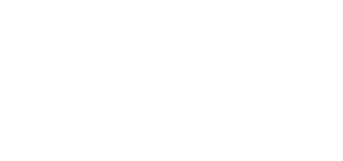

<!-- _class: title dark -->
<!-- _paginate: false -->



# Reproducible CI Without Docker

## The hard way, then the easy way

<div class="meta">

Chippewa Valley Developers Group
github.com/imkarrer/flox-buildkite-plugin

</div>

<!--
OPENING — this slide stays up as a PDF while people settle.

1. Point at the repo URL. "If you want to follow along, clone that. I'll
   give you a minute." Advance to the next slide so they have the commands.
2. Pass shirts and sharpies while they clone. ~20 people; don't rush it.
3. Once repos are out and shirts are in hands, the swag bit — spoken, not
   a slide:

   "I'm soon joining Flox, but I have no swag to hand out, so if you like
    it we're going to make our own. During this talk, if I've convinced
    you, write I ♥ Flox on the shirt and we'll take a picture at the end.
    If I haven't, find me after and I'll try to answer whatever I didn't."

4. Then the reveal: "What you're looking at is a PDF. I can keep my notes
   open next to it — that's why I baked speaker notes into the file. Fine
   as a backup. But these slides are markdown, and the toolchain that
   presents them is in the repo you just cloned. Watch."
-->

---


# Follow along

```console
$ git clone https://github.com/imkarrer/flox-buildkite-plugin
$ cd flox-buildkite-plugin/docs/talks
$ make serve                           # this will fail. that's the point
$ flox activate -- make serve     # now it works
```

<div class="small muted">

No Flox yet? **flox.dev/docs/install-flox/install**
macOS: `brew install flox` · Linux: `.deb` / `.rpm` · WSL is fine

</div>

<!--
Leave this up. Clone + shirts + swag happen on this slide.

PRE-FLIGHT: a CLEAN terminal — no flox activate, `command -v marp` is
empty, `echo $FLOX_ENV` is empty. `make` hits check-marp first, so
leftover build/ artifacts cannot hide the miss.

The beat, in order:
  1. `make serve` — let it fail. Read the error out loud.
     "marp is not on PATH. The toolchain lives in .flox/ — a file in
     this repo."
  2. `flox activate -- make serve`
  3. Open http://localhost:8080/slides.md, press P for presenter view.
  4. "If you cloned the repo, do the same. You just became a Flox user."

Don't wait for every laptop. Install is the long pole; people still
downloading can watch this one and catch up. Native Windows can't —
WSL can, say so once.

If `make` succeeds for someone, they already had marp. Skip them ahead
to serve.
-->

---

<!-- _class: lead dark -->

> You didn't install a toolchain.
> You activated one that lives in the repo.

<p>You're a Flox user. The rest of this talk is why that just worked.</p>

<!--
Let it sit for a beat. Don't explain Nix. Don't explain Flox. The demo
already did. Then into the question.
-->

---


# One question, three answers

> "Who's debugged a CI failure that reproduced nowhere else?"

<div class="cols">
<div>

### Laptop
brew, and a README with nine steps

### CI
a Dockerfile, or a pre-baked runner image

### Production
a golden server image, or a Kubernetes config

</div>
<div>

**Three** sources of truth for **one** question:

<div class="big">

*What software does this project need?*

</div>

</div>
</div>

<!--
Expand CI the first time you say it — "continuous integration, the thing that
runs your tests when you push." One clause, then move on.

Say: "Drift isn't a discipline problem, it's a design problem. We use three
mechanisms and act surprised when they disagree."
-->

---


# Why your package manager can't fix it

`apt install nodejs` is a **mutation of global shared state**.

- One version wins — installing Node 24 removes Node 22
- The result depends on **when** you ran it
- The result depends on **what was already there**
- Nothing describes what you got — `dpkg -l` describes the *machine*, not the *project*

<!--
The conceptual setup for everything after. Don't rush it.

Say: "Two projects needing different versions of the same thing are in direct
conflict, and nothing in this model can tell you what a build actually consumed."
-->

---

<!-- _class: lead dark -->

> A Dockerfile is **not reproducible**.
> A Docker image is **immutable**.

<p>We conflate those constantly.</p>

<!--
Highest value-per-second slide in the talk. Let it sit for a beat.
-->

---

<!-- _class: tight -->

# The sleight of hand

```dockerfile
FROM buildkite/agent:3          # mutable tag
RUN apt-get update \            # whatever is current TODAY
    && curl -fsSL https://deb.nodesource.com/setup_22.x | bash - \
    && apt-get install -y nodejs \
    && npm install -g pnpm@9    # a range, mutable registry
```

Build that today and in six months: **different images.** Nothing in the format prevents it.

<!--
Say: "We get repeatability by freezing the OUTPUT of a nondeterministic process,
then treating the frozen blob as the source of truth. That works until you need
to change something — because then you re-run the nondeterministic process. The
recipe was never what you trusted. The snapshot was."

Tone: you are NOT attacking Docker. Say that out loud. You're isolating one job
— defining a dev/CI environment — that it's heavy for.
-->

---


# And the day-two bill

- A second artifact **outside your repo**, versioned on its own schedule
- A registry to run, pay for, authenticate to, garbage-collect
- The tag-bump dance: edit, build, push, then bump the tag in a *separate* pull request
- Nothing links the image to the **commit that needed it**

<!--
Fast. Four bullets, fifteen seconds.

Say: "To answer 'what tools does my build need,' we stood up a pipeline that
itself needs maintaining. What if we shipped the RECIPE instead, precisely
enough that the snapshot is redundant?"
-->

---

<!-- _class: tight -->

# Nix: one idea

<div class="cols narrow-left">
<div>

Package manager + build system. Started **2003**, out of Eelco Dolstra's PhD work at Utrecht. **23 years old.**

**nixpkgs** — "Nix packages," its collection. ~120,000 projects: the largest general-purpose package collection there is.

Runs on any Linux and macOS. **You do not need NixOS.**

</div>
<div>

> `apt install` is a **statement**.
> Nix is an **expression**.

```text
build(source, deps, compiler, flags, …)
  → /nix/store/<hash>-name-version
```

```text
/nix/store/srhnlxadg479lhf3r6ijjc0
            arsxaimzs-hello-2.12.3
```

</div>
</div>

The hash is computed from **every** input, recursively — down to the C standard library. Change any input, get a different path. Nothing is ever mutated.

<!--
Discipline: teach EXACTLY one idea — the hash is the identity of the
recipe. Rollbacks and two MySQLs are consequences of that, not extra
topics. No Nix language, no flakes vs channels. Two minutes. Left
column is 20 seconds: 2003, nixpkgs, you do not need NixOS.

THE IDEA. Point at the path.
Say: "That's not a checksum of the output. It's an identity derived from
the complete recipe — every input, recursively, down to libc. Two
machines computing the same hash are asking for the same software built
the same way, by construction. Change any input, you get a different
directory. The old one is not overwritten. That's the whole trick."

TWO MYSQLS. Callback to slide 5 — two projects, one machine, they fight.
Say: "That's why you can have two MySQLs on the same laptop. 5.7 and 8.0,
or two 8.0s built against different OpenSSLs. Different inputs, different
hashes, different directories. They don't know the other exists. apt has
one slot — /usr/bin/mysql. Nix has as many slots as you have recipes.
nvm can do two Nodes. It cannot do two MySQLs whose dependency trees
disagree."

ROLLBACK.
Say: "And that's why rollback is real. Last week's tools are still on
disk. You are not re-downloading from a mirror that may have moved, or
hoping a registry still has that tag. You point at a path that never
left. If you did delete it, the recipe rebuilds the same bits."

PATH — two later slides depend on this, including the honest-limitations
slide. Entering one of these environments just puts those store paths at
the front of PATH — the list of directories your shell searches for
commands. No container, no VM. That's what makes it reproducibility
rather than isolation. The environment you activated in Act 0 is a set
of these paths. Another repo, another set. They coexist.

Don't overclaim "largest repository in existence" — npm has ~3M packages.

Then straight into the demo. The hard-way frame lives on the next slide —
one sentence, then type.
-->

---

<!-- _class: demo dark -->

<div class="kicker">Demo — 5 minutes</div>

# The hard way

<div class="cmd">raw Nix, by hand, no helpers</div>

<!--
This is the whole device. Say it, then type:

  "Not because you should ever work this way, but because in five minutes
   you'll see exactly what the easy way is doing for you."

PRE-FLIGHT: warm store, recorded fallback ready, terminal >=18pt, reset with
  rm -rf /tmp/hardway && mkdir -p /tmp/hardway && cd /tmp/hardway && git init
Paste from demo/CHEATSHEET.md — do not type the flake from memory.
Switch the projector to the terminal after the sentence. Switch back
for Beat 2 (point at the slide) and for the scoreboard.
-->

---

<!-- _class: tight -->

# Beat 1: what a beginner writes

```nix
# shell.nix
{ pkgs ? import <nixpkgs> {} }:
pkgs.mkShell {
  buildInputs = [ pkgs.nodejs_22 pkgs.pnpm ];
}
```

Four lines. Looks great. And it is **not reproducible** — `<nixpkgs>` is a channel, which is a mutable pointer.

*The Docker `latest` problem wearing a different hat.*

<!--
Backup slide — do this live if the demo is working.
FIRST CUT if you're overrunning. Saves 45s.
-->

---

<!-- _class: tight -->

# Beat 2: the honest version

<div class="cols">
<div class="wall">

```nix
{
  description = "Node dev environment";
  inputs.nixpkgs.url =
    "github:NixOS/nixpkgs/nixos-25.05";
  outputs = { self, nixpkgs }:
    let
      systems = [ "x86_64-linux"
        "aarch64-linux" "x86_64-darwin"
        "aarch64-darwin" ];
      forAllSystems = f:
        nixpkgs.lib.genAttrs systems
          (system: f
            nixpkgs.legacyPackages.${system});
    in
    {
      devShells = forAllSystems (pkgs: {
        default = pkgs.mkShell {
          packages = [ pkgs.nodejs_22
                       pkgs.pnpm ];
        };
      });
    };
}
```

</div>
<div>

**A lazy functional language.** A `let … in`, a lambda, attribute sets, `${}` interpolation.

**`genAttrs` + `legacyPackages`.** Boilerplate because flake outputs are keyed per-system, and I want four.

**`legacyPackages`** — named that because there's history you're now inheriting.

<div class="big">

20 lines. ~2 about my project.

</div>

</div>
</div>

<!--
THE ENTIRE PREMISE OF THE TALK. Never cut this.

Say: "I want two tools. Eighteen of these twenty lines are ceremony."

Don't say the boilerplate exists ONLY for cross-platform — you'd still need
devShells.x86_64-linux.default for a single system. Wanting four is what
forces the helper function.
-->

---

<!-- _class: tight -->

# Beat 3: the footgun

```console
$ nix develop --command node --version
error: Path 'flake.nix' in the repository "/tmp/hardway" is not tracked by Git.

       To make it visible to Nix, run:

       git -C "/tmp/hardway" add "flake.nix"
```

Flakes only see **git-tracked** files. My file is right there on disk and Nix refuses to look at it.

```console
$ git add flake.nix          # a file I haven't finished writing

warning: Git tree '/tmp/hardway' is dirty
```

*It generated a `flake.lock`, which is itself untracked. Every run warns me.*

<!--
Crowd-pleaser. Be fair: that error message is MUCH better than it used to be —
this used to silently not work.
-->

---

<!-- _class: tight -->

# Beat 4: it works, and it's genuinely good

```console
$ time nix develop --command bash -c 'node --version; pnpm --version'
copying path '/nix/store/xv1lyk…-nodejs-22.20.0' from 'https://cache.nixos.org'...
copying path '/nix/store/v2w0wx…-pnpm-10.15.1'   from 'https://cache.nixos.org'...
v22.20.0
10.15.1

real    0m22.013s
```

```console
$ time nix develop --command node --version
v22.20.0

real    0m0.486s
```

**22s cold, 0.49s warm** — and it's fetching prebuilt binaries from a cache, not compiling.

<!--
Say: "The guarantees are real: that flake.lock pins a nixpkgs commit, so this
resolves identically on my machine, your machine, and CI. NIX DELIVERS. My
complaint isn't that Nix doesn't work. It's what I had to write to get here."
-->

---

<!-- _class: tight -->

# Scoring the hard way

| What I wanted | What it cost |
|---|---|
| Node + pnpm | 20 lines of a functional language |
| Cross-platform | `genAttrs` / `legacyPackages` boilerplate |
| Pinned | Flakes — which vanilla Nix ships **disabled** behind an experimental flag |
| A file on disk | `git add` before Nix will look at it |
| Env vars and setup hooks | Available — as raw shell strings inside a Nix expression |
| Services (Postgres, Redis, your API) | **Not available.** Separate tooling entirely. |

<!--
ACCURACY: do NOT claim env vars and hooks are unavailable. mkShell supports
both — any attribute becomes an env var, and shellHook runs on entry. Verified.
Only SERVICES are truly absent from a plain devShell. Overstating this is the
most likely thing to get you corrected by a Nix user in the room.

Say: "Note the last two rows. I got packages. I CAN set environment variables
and a setup script, but only by embedding shell code inside a Nix expression.
And a Postgres for local dev? Not here — that's a different tool on top."
-->

---

<!-- _class: demo dark -->

<div class="kicker">Demo — 3 minutes</div>

# The easy way

<div class="cmd">same goal · same guarantees</div>

<!--
Fresh directory. Side by side with the first terminal if you can — the visual
contrast does the work.

PRE-FLIGHT: warm store, rm -rf /tmp/easyway, and
  export FLOX_DISABLE_METRICS=true
Paste services.toml from demo/ — do not live-type the JS one-liner.
Short commands (flox init / install / activate) you type.
Switch back to slides for the two-column money moment.
-->

---

<!-- _class: tight -->

# Two commands

```console
$ flox init
✔ Created environment 'easyway' (x86_64-linux)             real 0m0.070s

$ flox install nodejs_22 pnpm
✔ 'nodejs_22', 'pnpm' installed to environment 'easyway'   real 0m2.097s

$ flox activate -- bash -c 'node --version; pnpm --version'
v22.23.1
11.9.0                                                     real 0m0.450s
```

No language. Warm activation is **0.45s** — the same ballpark as `nix develop`'s 0.49.

*You are not paying for the ergonomics at runtime.*

<!--
Versions differ from the flake because Flox pins its own nixpkgs snapshot —
both are pinned, just to different revisions. Mention only if asked.
-->

---

<!-- _class: tight -->

# Same engine

<div class="rhyme">
<div class="grind">

<div class="label">Raw Nix — flake.nix</div>

```nix
{
  description = "Node dev environment";
  inputs.nixpkgs.url =
    "github:NixOS/nixpkgs/nixos-25.05";
  outputs = { self, nixpkgs }:
    let
      systems = [ "x86_64-linux"
        "aarch64-linux" "x86_64-darwin"
        "aarch64-darwin" ];
      forAllSystems = f:
        nixpkgs.lib.genAttrs systems
          (system: f
            nixpkgs.legacyPackages.${system});
    in
    {
      devShells = forAllSystems (pkgs: {
        default = pkgs.mkShell {
          packages = [ pkgs.nodejs_22
                       pkgs.pnpm ];
        };
      });
    };
}
```

<span class="match">20 lines of Nix</span>

</div>
<div class="shortcut">

<div class="label">Flox — manifest.toml</div>

```toml
[install]
nodejs_22.pkg-path = "nodejs_22"
pnpm.pkg-path = "pnpm"
```

<br />

<span class="match">4 lines of TOML</span>

</div>
</div>

<!--
THE MONEY MOMENT. Let the columns sit for a beat before you talk — 20 lines
versus 4 is the argument. Then:

  "Same engine. Same mechanism. Same guarantees. The line count isn't even
   the story — the story is that one of these requires learning a lazy
   functional language and the other is a list."

DON'T say "same store paths" — the flake resolved Node 22.20.0 and Flox
resolved 22.23.1, and both are visible on screen in your two terminals.

DON'T run a bare `cat` on the manifest live — flox generates a ~97-line
commented template. Use:
  grep -v '^\s*#' .flox/env/manifest.toml | grep -v '^$'
and say "flox generates a commented template; this is the signal."

If asked why manifest.lock (260 lines) dwarfs flake.lock (27): both are
generated, and Flox's pins every package's resolved store path where
flake.lock pins only the nixpkgs input and re-derives the rest.
-->

---

<!-- _class: tight -->

# And then it does more

<div class="cols">
<div>

```toml
[vars]
API_PORT = "8080"

[hook]
on-activate = '''
  echo "env ready: node $(node --version)"
'''

[services]
api.command = "node -e '…http server…'"
```

</div>
<div>

```console
$ flox activate --start-services -- \
    bash -c 'curl -s localhost:$API_PORT;
             flox services status'

env ready: node v22.23.1
hi
NAME    STATUS     PID
api     Running   2764
```

</div>
</div>

One file replaced my package list, my `.env`, my setup script, **and** my `docker-compose.yml` for local services.

<!--
THE BEAT THAT CONVERTS PEOPLE. Cut only if desperate.

Say: "Remember the last row of the hard-way scoreboard? Raw Nix devShells
don't do any of this."

Pre-write this manifest and paste it. Do NOT live-type TOML containing an
embedded JS one-liner.
-->

---

<!-- _class: lead dark -->

> Flox isn't hiding Nix from you.
> It's saving you from typing it.

<!--
The hard way wasn't wasted — they now know what's underneath: a store where
every path is a hash of its whole recipe, a lockfile pinning a nixpkgs
revision, symlinks on PATH.

Then 15 seconds of credibility, no more: "Open source command-line tool over
Nix, out of D. E. Shaw's internal tooling — one of the largest enterprise Nix
deployments anywhere. Spun out as a company in 2022."

Consider cutting the funding number entirely; the D. E. Shaw provenance is the
part that earns credibility with developers.
-->

---

<!-- _class: tight -->

# Buildkite in 30 seconds

<div class="cols">
<div>

Continuous integration and delivery platform (**CI/CD**), founded 2013 in Melbourne.

OpenAI · Anthropic · Uber · Shopify · Canva

```yml
steps:
  - label: ":test_tube: test"
    command: npm test
```

</div>
<div>

### The hybrid model

**Buildkite** hosts the control plane — orchestration, the web interface, logs.

**You** run the agents, on your own infrastructure.

Agents poll **out**. Nothing inbound. Your code and secrets never leave your perimeter.

</div>
</div>

**Contrast:** GitHub Actions and CircleCI default to *their* runners with *their* preinstalled images. Buildkite defaults to *your* compute.

<!--
Do NOT teach Buildkite. Land one architectural fact, then the payoff.
-->

---

<!-- _class: tight -->

# Which makes this your problem

If you own the agents, you own **what's installed on them.** There is no `ubuntu-latest` with fifty toolchains.

1. Install toolchains on the agent host → agents become pets, versions conflict
2. Bake an agent image per toolchain → back to the registry pipeline, now for CI infra
3. Wrap every step in the Docker plugin → an image to maintain per step
4. Install tools at the top of every job → slow, and not reproducible

<!--
THE PIVOT. Slow down.

Say: "Buildkite's greatest strength — you own the build environment — is
exactly what makes 'what's installed on my agents' a permanent problem. We just
spent ten minutes on a really good answer to that question."
-->

---

<!-- _class: tight -->

# The plugin

<div class="cols">
<div>

Flox ships integrations for GitHub Actions, CircleCI, and GitLab. **For Buildkite there's no official one.**

```yml
steps:
  - label: ":flox: build"
    plugins:
      - imkarrer/flox#v1.0.0:
          command: npm run build
```

A Buildkite plugin is just **a git repo with hook scripts** — no framework, nothing to publish.

</div>
<div>

### The part that runs your build

```bash
exec flox activate \
  "${FLOX_ARGS[@]}" -c "${COMMAND}"
```

<div class="big">

One line.

</div>

The other ~400 make flox **exist** on a throwaway agent, and make cold builds fast.

</div>
</div>

<!--
Say: "That's the punchline — the part that runs your build is one line."
Pause for the laugh; it's the good kind — oh, that's all it is.

Then the honest follow-up, which is a BETTER story than "it's only 70 lines":
"About four hundred lines across four hooks. One line runs your build. The
other four hundred download the right .deb, .rpm, or .pkg for the
architecture, start the Nix daemon or fall back to single-user mode on
containers without systemd, seed a cold /nix cache volume, and wire up a
shared binary cache. That's the work you'd otherwise hand-roll in every
pipeline — which is exactly why it's a plugin instead of a snippet."

Reference is `imkarrer/flox` — Buildkite strips the -buildkite-plugin suffix.
Prior art: jbayer/flox-buildkite. Say "no OFFICIAL integration," not
"nothing," and credit it. Costs five seconds, and you look better for it.

NOTE: no git tags exist yet — either tag v1.0.0 or change this to #main
before someone copies it off your slide.
-->

---

<!-- _class: tight -->

# When *not* to do this

- **Nix gives reproducibility, not isolation.** It's `PATH` manipulation, not a sandbox. Untrusted build steps still want a container.
- **If the image is your deliverable, keep building images.** `flox containerize` emits a standard OCI container image, so it isn't either/or.
- **If your dependency isn't in nixpkgs**, you're writing a Nix *derivation* — a build recipe in the Nix language. This is the real adoption tax.
- **Cold start isn't free.** Mitigations: pre-baked agent image, a shared S3 binary cache, or seeding a cold `/nix` volume.

<!--
NEVER CUT THIS. With developers, the honest-limitations slide is where you gain
credibility — and it defuses your sharpest Q&A.

The numbers you showed (22s flake, ~2.6s Flox) were against a populated store.
A genuinely cold agent also installs flox and realizes every package with no
cache. Measure it on your own runner before quoting a number.

Say: "I'm not asking you to delete Docker. I'm asking you to stop using it to
answer a question a text file answers better."
-->

---

<!-- _class: lead dark -->

## Docker ships an immutable **snapshot**.<br />Nix ships a pinned **recipe**.

<p>Nix has been right for 23 years and hard for most of them.</p>

---

<!-- _class: title dark -->


# Your environment belongs in your repo

## In the same commit as the code that needs it

<div class="meta">

flox.dev/docs/install-flox/install
github.com/imkarrer/flox-buildkite-plugin
buildkite.com/docs/pipelines/architecture

</div>

<!--
CLOSING LINE: "You only have to do the hard one once — and I already did it
for you."

Then the photo: anyone who wrote on a shirt, up front, one shot. Don't
force it — empty hands are the honest outcome of the opening bet.

Do NOT put a `curl | bash` one-liner on this slide. Flox doesn't ship one;
flox.dev/install returns 404. Current paths: brew install flox on macOS, a
.pkg installer, .deb/.rpm from downloads.flox.dev, or
  nix profile install --accept-flake-config 'github:flox/flox/latest'
where Nix already exists.
-->
